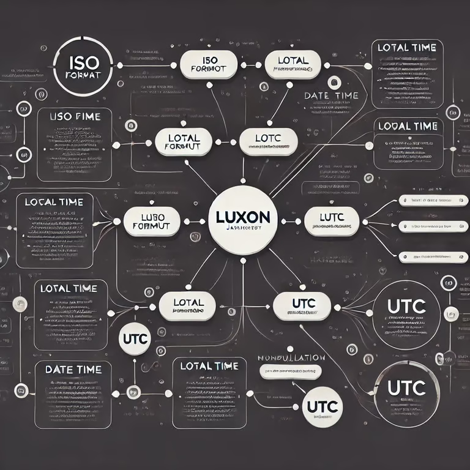

Luxon은 자바스크립트에서 날짜와 시간을 처리하기 위한 라이브러리입니다. 자바스크립트에서 날짜와 시간을 다룰 때 Date API를 사용해본 경험이 있으시면 날짜와 시간을 다루는 것이 여간 짜증나는 일이 아닐 수 없는데요. Luxon은 자바스크립트에서 날짜와 시간을 다루는 일을 보다 쉽게 만들어 주는 라이브러리입니다. 이번 포스팅에서는 Luxon의 주요 특징과 사용법에 대해서 살펴보겠습니다.

## Luxon이란?

Luxon은 날짜 라이브러리 Moment의 유지보수자 중 한 개발자가 Moment의 한계를 극복하기 위해 Moment의 체이닝 방식을 유지한 채 브라우저 내장 Intl API를 사용하여 국제화, 타임존 지원 및 날짜 파싱기능을 제공하는 라이브러리입니다. 또한 보다 강력한 Duration 기능을 제공하고 모든 데이터 타입을 불변(Immutable)으로 설계되어 있습니다.

이러한 접근 방식의 장점은 코드가 이해하고 디버깅하기 쉬워지고 브라우저 내장 기능을 활용하기 때문에 유지보수가 쉽고, 국제화 동작이 뛰어납니다. Luxon은 자바스크립트 날짜 라이브러리 중 강력한 타임존 지원을 제공합니다. 또한, Duration 기능을 통해 날짜에 대한 계산을 아주 쉽게 사용할 수 있습니다.

하지만 단점도 있습니다. 최신 브라우저 기능(Intl API)을 사용하기 때문에, 지원되지 않는 환경이 있을 수 있습니다(크롬 v24, 엣지 v12, 파이어폭스 v29, 사파리 v10 이상). 가장 빠르게 릴리즈된 날짜가 2013년도이기 때문에 웬만하면 Luxon의 국제화 기능을 쓰는데 무리는 없을겁니다.

### Luxon 설치법

```bash
npm install --save luxon
```

타입스크립트 사용 시 추가 설치

```bash
npm install --save-dev @types/luxon
```

## 기본 사용법

```typescript
import { DateTime } from "luxon";

const date = DateTime.now();
// DateTime { ts: 2025-02-27T15:43:18.503+09:00, zone: Asia/Seoul, locale: ko-KR }
```

DateTime은 특정 날짜와 시간을 나타내는 불변 데이터이며 여러 메서드를 수반하고 있습니다. DateTime 인스턴스는 Unix epoch의 특정 밀리초를 참조하는 timestamp, 로컬 시스템의 zone을 고려한 time zone, locale, numberingSystem, outputCalendar와 같은 출력 문자열을 설정 프로퍼티로 구성되어 있습니다.

DateTime 인스턴스를 만드는 가장 좋은 방법은 모든 정보가 포함된 객체를 제공하는 겁니다.

```typescript
const date2 = DateTime.fromObject(
  { year: 1996, month: 2, day: 29, hour: 9 },
  { zone: "Asia/Seoul" }
);
// DateTime { ts: 1996-02-29T09:00:00.000+09:00, zone: Asia/Seoul, locale: ko-KR }

const date3 = DateTime.fromObject(
  { year: 2025, month: 2, day: 29, hour: 9 },
  { zone: "Asia/Seoul" }
);
// DateTime { Invalid, reason: unit out of range } 윤년이 아닌 해의 2월 29일도 잘 인식하고 있군요!
```

DateTime의 구성요소를 얻는 것도 직관적입니다.

```typescript
const date = DateTime.now();
console.log(date);
// DateTime { ts: 2025-02-27T16:14:41.762+09:00, zone: Asia/Seoul, locale: ko-KR }\n
console.log(date.year); // 2025
console.log(date.month); // 2
console.log(date.day); // 27
console.log(date.hour); // 16
console.log(date.minute); // 14
console.log(date.second); // 41
console.log(date.weekday); // 4
console.log(date.zoneName); // Asia/Seoul
console.log(date.offset); // 540 (UTC에서 몇분 멀어져 있는지)
console.log(date.daysInMonth); // 28 (현재 달의 일 수)
```

## DateTime 포매팅

DateTime 객체를 문자열로 변환할 때는 크게 다음과 같은 방식을 사용할 수 있습니다.

1. **기술 형식(ISO 8601, RFC 2822 등)으로 출력**
2. **국제화(Localization)를 고려한 형식**
3. **토큰 기반 형식 (toFormat)**

### 기술 형식 (ISO 8601, RFC 2822 등)

- **toISO()**: ISO 8601 형식 문자열을 반환합니다.
- **toISODate()**: 날짜만 ISO 8601 형식으로 반환합니다.
- **toISOTime()**: 시간만 ISO 8601 형식으로 반환합니다.
- **toRFC2822()**: `RFC 2822` 형식 문자열을 반환합니다.

```typescript
const now = DateTime.now();

console.log(now.toISO());
// 2025-02-27T16:45:24.442+09:00
console.log(now.toISODate());
// 2025-02-27
console.log(now.toISOTime());
// 16:45:24.442+09:00
console.log(now.toRFC2822());
// Thu, 27 Feb 2025 16:45:24 +0900
```

### 국제화(Localization)를 고려한 형식

Luxon은 내부적으로 브라우저 내장 **Intl API**를 활용하므로, 로케일이나 시간대를 지정하여 날짜·시간을 사람에게 읽기 좋은 형식으로 만들 수 있습니다.

```typescript
const now = DateTime.now();

const localizedDate = now.setLocale("ko-KR"); // 한국식으로 설정
console.log(localizedDate.toLocaleString(DateTime.DATE_FULL)); // 2025년 2월 27일
console.log(localizedDate.toLocaleString(DateTime.TIME_SIMPLE)); // 오후 4:49
```

### 토큰 기반 형식 (toFormat)

Moment에서와 비슷한 토큰(**yyyy**, **LLL**, **dd**, **HH**, **mm**, **ss** 등)을 사용하여 자유롭게 날짜·시간 포맷 문자열을 만들 수 있습니다.

```typescript
const now = DateTime.now();

console.log(now.toFormat("yyyy-MM-dd HH:mm:ss")); // 2025-02-27 16:55:13
console.log(now.toFormat("yyyy LLL dd (ccc)")); // 2025 Feb 27 (Thu)
```

자세한 토큰 목록은 공식 문서의 [Formatting](https://moment.github.io/luxon/#/formatting?id=table-of-tokens)섹션에서 확인할 수 있습니다.

## DateTime 연산

Luxon은 **불변(Immutable)** 설계를 지향하므로, **DateTime** 객체에 연산 메서드를 사용할 때마다 새로운 **DateTime 인스턴스가 반환**됩니다.

### 1. 더하기와 빼기 (plus, minus)

- **plus(durationLike)**: 일정 기간을 더한 새로운 **DateTime** 반환
- **minus(durationLike)**: 일정 기간을 뺀 새로운 **DateTime** 반환

```typescript
// 오늘 날짜에서 10일 뒤
const plusTenDays = now.plus({ days: 10 });
console.log(plusTenDays.toString());

// 오늘 날짜에서 2시간 전
const minusTwoHours = now.minus({ hours: 2 });
console.log(minusTwoHours.toString());
```

### 2. 시작점과 끝점 (startOf, endOf)

일정 단위의 시작점 혹은 끝점을 구할 때는 **startOf(unit)**, **endOf(unit)** 메서드를 사용합니다.

```typescript
const today = DateTime.local(2025, 2, 27, 16, 0);
// 2025-02-27 16:00

console.log(today.startOf("day").toString()); // 2025-02-27T00:00:00.000+09:00
console.log(today.endOf("day").toString()); // 2025-02-27T23:59:59.999+09:00
console.log(today.startOf("month").toString()); // 2025-02-01T00:00:00.000+09:00
console.log(today.endOf("month").toString()); // 2025-02-28T23:59:59.999+09:00 (2월이므로 28일 끝)
```

### 3. 두 DateTime 간 차이 구하기 (diff)

Luxon의 diff 메서드는 두 **DateTime** 간의 차이를 **Duration** 형태로 반환합니다.

```typescript
const start = DateTime.fromObject({ year: 2025, month: 1, day: 1 });
const end = DateTime.fromObject({ year: 2025, month: 2, day: 27 });

// diff(상대시간, 단위)
const diffInDays = end.diff(start, "days");
console.log(diffInDays.days); // 57 (2025-01-01 ~ 2025-02-27 까지의 일수)
```

## 마무리하며

이상으로 Luxon에서 날짜와 시간을 **포매팅(Formatting)**, **국제화(Internationalization)**, **연산(Math)** 하는 방법에 대해 간략히 살펴봤습니다.
이 포스팅을 통해 Luxon을 활용하여 날짜와 시간를 다루는데 편안함을 느끼실 수 있으셨으면 좋겠습니다.
