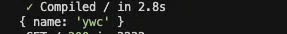

새로운 프로젝트에 들어가면서 백엔드 API가 만들어지기 전 프론트개발을 진행하기 위해 Mock API를 도입해서 사용해봤습니다.

그 중 **MSW**(**Mock Service Worker**)라는 자바스크립트를 위한 Mocking 라이브러리를 알게되었고, 제가 공식문서와 구글링을 하며 여러 뻘짓과 시행착오를 겪고 난 후 가장 쉽게 **MSW**를 **Next.js** **15+** 에 설치하는 간단한 방법을 소개하려고 합니다.

## MSW(Mock Service Worker)란?

그 전에 MSW에 대해서 간단하게 알고 지나가겠습니다. 프론트엔드 개발을 하면서 API가 준비되지 않아 개발이 지연되거나, API가 자주 변경되어 곤란했던 경험이 있나요? 혹은 테스트 환경을 구축하는 데 어려움을 겪은 적이 있나요? 이런 상황에서 유용하게 사용할 수 있는 도구가 바로 **MSW**(**Mock Service Worker**)입니다.

**MSW**는 브라우저와 **Node.js 환경에서 실제 서버 API 없이도 네트워크 요청을 가로채 가상(mock) 응답을 제공하는 라이브러리입니다.** MSW는 **Service Worker**라는 브라우저 기술을 활용하여 브라우저 레벨에서 네트워크 요청을 처리하기 때문에, 별도의 코드 수정 없이도 마치 실제 API가 존재하는 것처럼 프론트엔드 개발과 테스트를 진행할 수 있게 해줍니다.

공식문서에서 MSW의 특징으로는 애플리케이션의 코드가 어떤 것이 Mocking되었는지 알지 못하게 하고, 동일한 프로덕션 리소스를 요청하고 애플리케이션의 실제 동작을 테스트할 수 있다고 합니다. 또한, **Express 와 같은 라우팅 구문**으로 request를 만들기 때문에 친숙하다고 표현합니다.

이번 글에서는 **Next.js** **15+** 환경에 **MSW**를 직접 설치하고 설정한 경험을 바탕으로 설치법을 소개해보겠습니다.

## 설치법

저는 **Next.js** **15.2.1** 버전과 **pnpm**으로 진행했습니다.

```bash
pnpm add msw@latest --save-dev
```

이 후 Service Worker를 설치해주어야 합니다.

MSW에서는 **서비스 워커를 public 디렉토리에 빠르게 생성해주는 CLI**를 제공해 주고 있습니다.

**npx msw init \<PUBLIC_DIR\> --save**에 맞게 public 디렉토리를 입력해주면 됩니다.

```bash
pnpx msw init public/ --save
```

실행 후 public 디렉토리에 **\*mockServiceWorker.js**가 잘 생성될 것입니다. 또한 package.json엔 아래 코드가 추가 되어있을 겁니다!

```json
{
  "msw": {
    "workerDirectory": ["public"]
  }
}
```

이제 Integration을 해주어야 합니다. intergration 방법 중 Browser integration과 Node.js integration 모두 사용해야 합니다.
왜냐하면 Next.js의 RSC는 Node.js 환경에서 실행되기 때문입니다.

먼저 **mocks**디렉토리를 **app**폴더와 같은 위치에 있도록 만듭니다. 그 후 아래 파일과 코드들을 작성해줍니다.

```tsx
// /src/mocks/browser.ts
import { setupWorker } from "msw/browser";
import { handlers } from "./handlers";

export const worker = setupWorker(...handlers);
```

```tsx
// /src/mocks/server.ts
import { setupServer } from "msw/node";
import { handlers } from "./handlers";

export const server = setupServer(...handlers);
```

```tsx
// src/mocks/handlers.ts
import { http, HttpResponse } from "msw";

export const handlers = [
  http.get("https://example.com/resource", () => {
    return HttpResponse.json({
      name: "ywc",
    });
  }),
];
```

테스트용 가짜 api를 만들어 줍니다. 자세한 Mock API를 만들려면 [공식문서](https://mswjs.io/)를 참조하세요

```tsx
// src/mocks/MSWInitializer.tsx 또는 components 디렉토리
"use client";

import { useEffect } from "react";

export function MSWInitializer() {
  useEffect(() => {
    async function initMocks() {
      if (typeof window === "undefined") {
        const { server } = await import("../mocks/server");
        server.listen();
      } else {
        const { worker } = await import("../mocks/browser");
        await worker.start();
      }
    }
    initMocks();
  }, []);
  return null;
}
```

각각 브라우저와 Node.js 환경에서 요청을 가로채기 위한 설정들을 초기 실행하기 위해 **MSWInitializer** 컴포넌트를 만듭니다.

이후 루트 레이아웃에서 개발 환경에서만 실행되게 해줍니다.

```tsx
export default function RootLayout({
  children,
}: Readonly<{
  children: React.ReactNode;
}>) {
  return (
    <html lang="ko">
      <body>
        {process.env.NODE_ENV === "development" && <MSWInitializer />}
        {children}
      </body>
    </html>
  );
}
```

이후 **instrumentation.ts**를 이용하여 Next.js가 서버 사이드 렌더링(Server-side Rendering) 또는 RSC(React Server Components)를 Node.js 환경에서 처리할 때 MSW 서버를 활성화해서, **서버에서 발생하는 네트워크 요청을 가로채고 mock 응답을 반환할 수 있도록** 합니다.

과거 Next.js 버전에서는 네트워크 요청을 가로채고(mocking), 개발 및 테스트 환경을 구성할 때 별도의 실험적 옵션(experimental)을 활성화하여 MSW의 네트워크 요청 가로채기 기능이 정상 작동하게 해줘야 했습니다.

그러나 **Next.js** **15** **이상**부터는 기본적으로 요청을 가로채는 Service Worker 관련 기능을 내부적으로 지원하여, 별도의 실험적 옵션(**instrumentationHook: true**)을 켜지 않아도(next.config.ts에 옵션을 주지 않아도) MSW가 제공하는 **instrumentation.ts**와 같은 설정파일만 있으면 바로 동작합니다.

```tsx
// src/instrumentation.ts
export async function register() {
  if (process.env.NEXT_RUNTIME === "nodejs") {
    const { server } = await import("./mocks/server");
    server.listen();
  }
}
```

여기까지 설정을 다 하고 브라우저 콘솔을 보면 아래 메시지가 떴다면 성공입니다.


이후 fetch하고 log를 찍어보려고 하면 안되실 겁니다! 왜냐하면 서버를 재시작을 해줘야 하기 때문이죠...

서버를 재시작을 해주면 정상적으로 Mock API가 작동하는 것을 볼 수 있습니다.



MSW를 사용해보면서, Mock API를 수정할 때 마다 서버를 재시작해야 한다는 매우 큰 단점이 있었습니다.... HMR(Hot Module Replacement)를 지원을 안하는 것인지 제가 못찾는건지 공식문서에서는 찾아볼 수 없어서 매우매우 아쉬웠습니다. 아니면 제가 설정을 잘못했는지...?

## 마무리하며

Next.js에 MSW를 설치하는 법을 알아봤습니다. 저도 공식문서와 여러 회사의 기술블로그의 도움과 여러 시행착오를 겪어 MSW를 설치하는데 성공을 했습니다. Next.js에 MSW를 도입하시는 분들께 도움이 되었으면 좋겠습니다.
