"액세스 토큰을 어디에 저장하는가"는 단순한 저장소 선택이 아닙니다. 이 결정 하나가 **SSR(Server-Side Rendering) 가능 여부, UX(사용자 경험), 보안, 코드 구조**까지 결정합니다. 이 글에서는 두 프로젝트에서 서버 세션 + Proxy 패턴과 SSR Prefetch 아키텍처로 이 문제를 해결한 과정을 다룹니다.

## 1부: 브라우저 메모리에서 서버 세션으로

### 백엔드가 내려주는 응답 구조

첫 번째 프로젝트에서 로그인 API를 연동할 때 한 가지 제약이 있었습니다. 백엔드가 **액세스 토큰과 사용자 정보는 JSON 본문에**, 리프레시 토큰은 **HTTP-Only 쿠키에** 담아 보내는 구조였습니다.

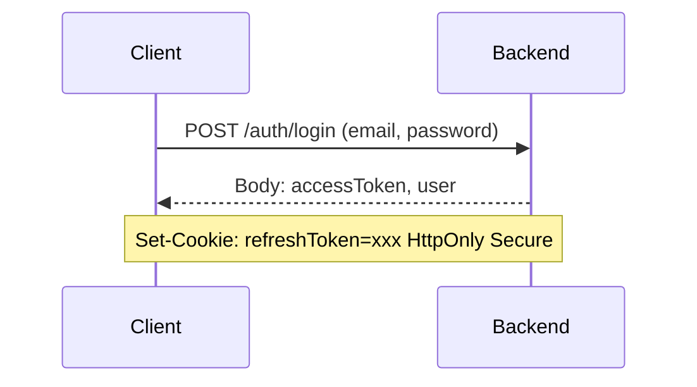

리프레시 토큰은 HTTP-Only 쿠키이므로 JavaScript에서 접근할 수 없습니다. XSS(Cross-Site Scripting) 공격으로부터 보호하기 위한 설계입니다. 문제는 액세스 토큰입니다. 응답 본문으로 받은 이 토큰을 **어디에 저장하느냐**에 따라 인증 아키텍처 전체가 달라집니다.

### 1차 시도: 브라우저 메모리(Zustand)에 저장

가장 직관적인 선택은 Zustand 같은 상태 관리 라이브러리로 **브라우저 메모리**에 저장하는 것입니다. 브라우저 메모리는 localStorage보다 XSS에 안전합니다. localStorage는 JavaScript로 언제든 접근할 수 있지만, 메모리에 있는 값은 탈취 경로가 제한적입니다.


단순하고 동작도 잘 됩니다. 하지만 곧 세 가지 문제가 나타났습니다.

### 문제 1: 새로고침 시 토큰 소실

브라우저 메모리는 **페이지를 새로고침하면 초기화**됩니다. Zustand store가 비워지면서 액세스 토큰이 사라집니다.

이를 해결하기 위해 앱 초기화 시 리프레시 토큰으로 액세스 토큰을 재발급받는 로직을 추가했습니다. 리프레시 토큰은 HTTP-Only 쿠키에 있으므로, 브라우저가 자동으로 쿠키를 첨부하여 갱신 요청을 보냅니다.

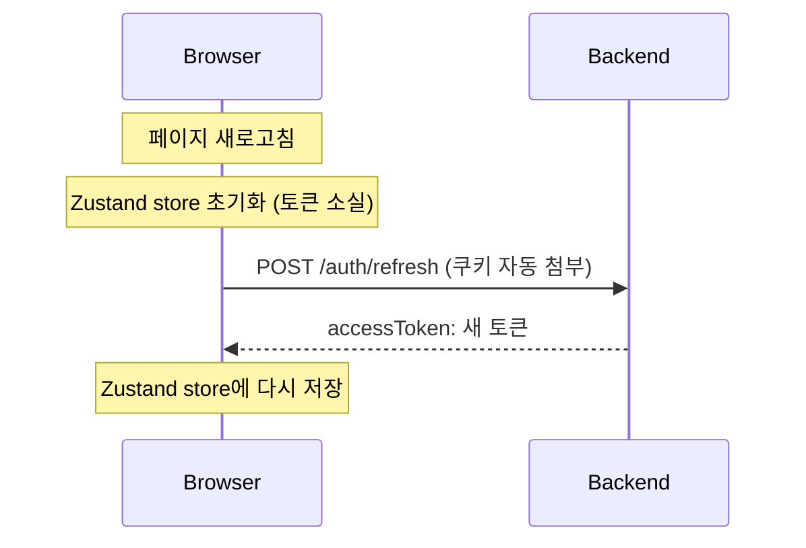

기능적으로는 동작했지만, 새로운 문제를 만들었습니다.

### 문제 2: UI 깜빡임

새로고침 후 토큰 재발급이 완료되기까지 수백 ms의 공백이 생깁니다. 이 시간 동안 앱은 "로그인되지 않은 상태"로 판단합니다.


로그인 버튼이 잠깐 보였다가 프로필 메뉴로 바뀌는 깜빡임이 발생합니다. 눈에 띄는 UX 결함이었습니다.

### 문제 3: SSR에서 접근 불가

가장 치명적인 문제입니다. **Server Component에서 액세스 토큰에 접근할 수 없습니다.**

Next.js App Router의 Server Component는 서버에서 실행됩니다. 인증이 필요한 데이터를 서버에서 미리 가져오려면 액세스 토큰이 필요한데, 그 토큰은 브라우저 메모리에만 있습니다.

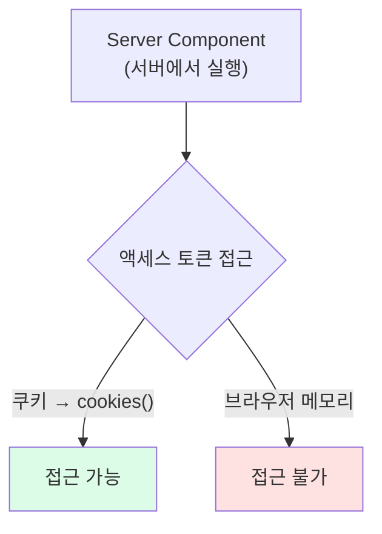

서버에서 데이터를 미리 가져올 수 없으니, 모든 데이터 페칭이 클라이언트에서 일어납니다. Next.js를 쓰면서 SSR의 이점을 전혀 활용하지 못하는 상황이었습니다.

### 근본 원인과 해결: 서버 세션

세 가지 문제의 근본 원인은 하나입니다. **액세스 토큰이 브라우저에만 존재한다는 것.** 토큰을 서버에서 접근할 수 있는 곳으로 옮기면 모든 문제가 해결됩니다.

Next.js 서버에 **인메모리 세션 저장소**를 만들어 액세스 토큰을 저장하는 구조로 전환했습니다.

```typescript
// server-session.ts
const sessionStore = new Map<string, SessionData>();

type SessionData = {
  accessToken: string;
  refreshToken: string;
  userData: { name: string; role: string } | null;
};

export function createSession(data: SessionData): string {
  const sid = crypto.randomUUID();
  sessionStore.set(sid, data);
  return sid;
}

export function getSession(sid: string) {
  return sessionStore.get(sid);
}
```

글로벌 `Map`에 세션 데이터를 저장하고, UUID로 생성한 세션 ID(`sid`)를 키로 사용합니다. 로그인 Route Handler에서 이 세션을 생성합니다.

```typescript
// app/proxy/auth/login/route.ts
export async function POST(request: Request) {
  const body = await request.json();
  const res = await fetch(`${BACKEND_URL}/auth/login`, {
    method: "POST",
    body: JSON.stringify(body),
  });

  const { accessToken, name, role } = await res.json();
  const refreshToken = extractCookieValue(res, "refreshToken");

  // 토큰은 서버 세션에만 저장
  const sid = createSession({
    accessToken,
    refreshToken,
    userData: { name, role },
  });

  // 브라우저에는 세션 ID만 전달
  (await cookies()).set("sid", sid, {
    httpOnly: true,
    secure: true,
    sameSite: "lax",
    maxAge: 3600,
  });

  // 응답에 토큰을 포함하지 않음
  return Response.json({ name, role });
}
```

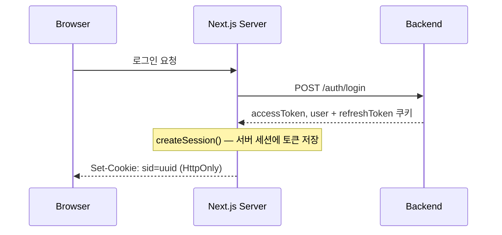

이제 액세스 토큰은 **Next.js 서버의 `Map`**에 있습니다. 브라우저에는 세션 ID만 HttpOnly 쿠키로 존재하므로, JavaScript에서 토큰에 접근할 수 없습니다.

- **새로고침?** 세션은 서버 메모리에 있으므로 초기화되지 않습니다
- **SSR?** Server Component에서 `cookies()`로 세션 ID를 읽고, 세션에서 액세스 토큰을 꺼내 API를 호출할 수 있습니다

### SSR 하이드레이션으로 깜빡임 해결

UI 깜빡임 문제도 서버 세션으로 해결할 수 있습니다. `layout.tsx`에서 세션을 읽어 Zustand store의 초기값으로 주입합니다.

```tsx
// app/layout.tsx
export default async function RootLayout({ children }: { children: React.ReactNode }) {
  const sid = (await cookies()).get("sid")?.value;
  const session = sid ? getSession(sid) : null;
  const userData = session?.userData ?? null;

  return <UserStoreProvider initialState={{ userData }}>{children}</UserStoreProvider>;
}
```

서버에서 이미 인증 상태를 알고 있으므로, 첫 렌더링부터 올바른 UI를 표시합니다. "비로그인 UI → 로그인 UI" 전환이 사라집니다.

### Catch-all Proxy 패턴

서버 세션으로 전환하면서 SSR 문제는 해결되었습니다. 하지만 **클라이언트 측 요청**에서 새로운 문제가 생겼습니다. 버튼 클릭으로 데이터를 수정하거나 추가 조회를 할 때, 액세스 토큰이 서버 세션에 있어서 클라이언트에서 직접 백엔드를 호출할 수 없습니다.

이 문제를 **catch-all Route Handler** `[...path]`로 해결했습니다. 모든 API 요청을 하나의 핸들러에서 처리합니다.

```typescript
// app/proxy/[...path]/route.ts
async function proxyRequest(request: Request) {
  const sid = (await cookies()).get("sid")?.value;
  const session = sid ? getSession(sid) : undefined;

  // /proxy/api/v1/todos → BACKEND_URL/api/v1/todos
  const url = new URL(request.url);
  const backendPath = url.pathname.replace("/proxy", "");

  return fetch(`${BACKEND_URL}${backendPath}${url.search}`, {
    method: request.method,
    headers: { Authorization: `Bearer ${session?.accessToken}` },
    body: ["GET", "HEAD"].includes(request.method) ? undefined : await request.text(),
  });
}

export {
  proxyRequest as GET,
  proxyRequest as POST,
  proxyRequest as PUT,
  proxyRequest as PATCH,
  proxyRequest as DELETE,
};
```

클라이언트에서는 `apiFetch` 헬퍼가 URL을 자동으로 리라이트합니다.

```typescript
// lib/api.ts
export async function apiFetch({ url, ...options }: ApiOptions) {
  // /api/v1/todos → /proxy/api/v1/todos (프록시 경유)
  const proxyUrl = url.startsWith("/api/") ? `/proxy${url}` : url;

  return fetch(proxyUrl, { credentials: "include", ...options });
}
```

클라이언트 코드에서는 `/api/v1/todos`로 호출하지만, 실제로는 `/proxy/api/v1/todos` Route Handler를 거쳐 백엔드에 도달합니다. **클라이언트가 액세스 토큰을 직접 다루지 않습니다.**

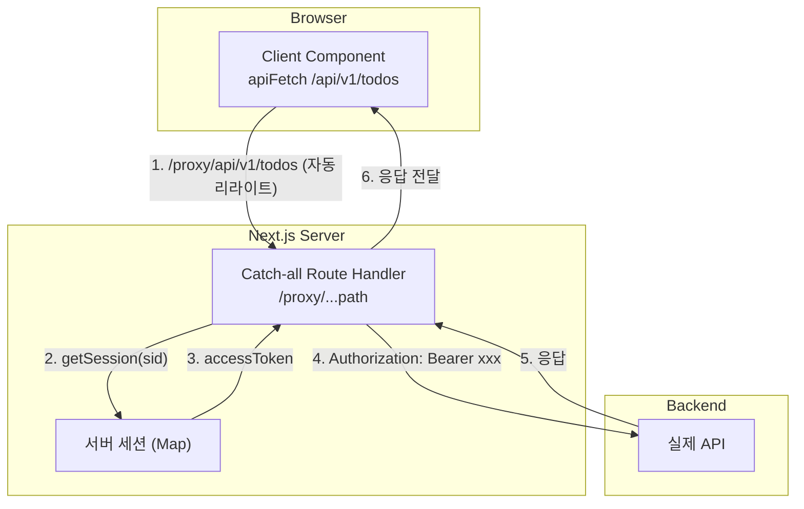

### 투명한 토큰 갱신

Proxy 패턴의 또 다른 장점은 **토큰 갱신을 서버에서 투명하게 처리**할 수 있다는 점입니다. 클라이언트는 토큰 만료를 전혀 인지하지 못합니다.

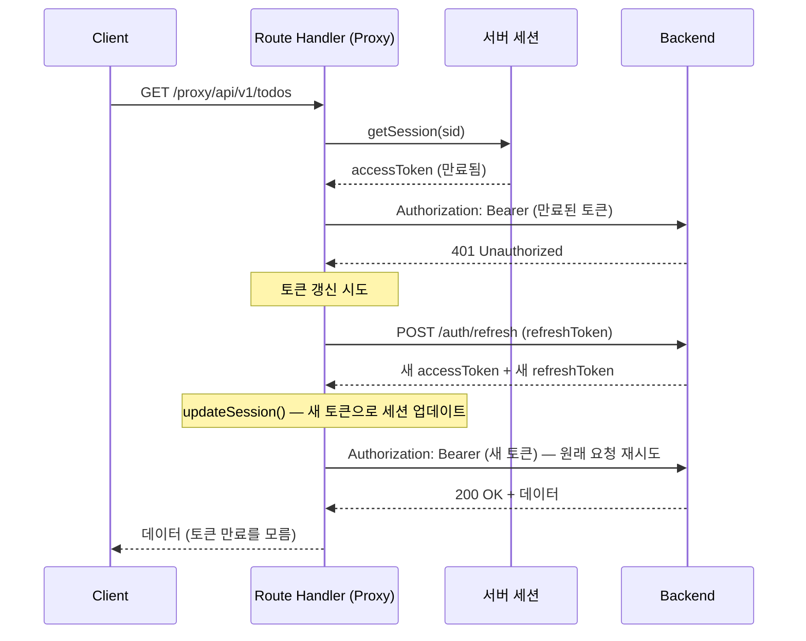

Proxy가 401 응답을 받으면 세션의 리프레시 토큰으로 새 액세스 토큰을 발급받고, 세션을 업데이트한 뒤 원래 요청을 재시도합니다. 클라이언트에는 토큰 갱신 로직이 필요 없습니다.

### 1부 정리

| 문제                  | 브라우저 메모리         | 서버 세션 + Proxy                    |
| --------------------- | ----------------------- | ------------------------------------ |
| 새로고침 시 토큰 소실 | 매번 재발급 필요        | 서버 메모리에 유지                   |
| UI 깜빡임             | 비로그인 → 로그인 전환  | layout.tsx에서 세션 읽어 초기값 주입 |
| SSR 데이터 페칭       | 서버에서 토큰 접근 불가 | cookies() → 세션 조회 → API 호출     |
| 토큰 보안             | 메모리라 비교적 안전    | 브라우저에 토큰 자체가 없음          |
| 클라이언트 요청       | 직접 호출 가능          | Catch-all Proxy 경유                 |
| 토큰 갱신             | 클라이언트에서 처리     | Proxy에서 투명하게 처리              |

---

## 2부: SSR + Prefetch로 한 단계 더

### 다른 시작점, 같은 문제

두 번째 프로젝트에서는 인증 구조가 달랐습니다. 백엔드가 로그인 시 액세스 토큰과 리프레시 토큰을 **둘 다 응답으로** 내려주고, 프론트엔드에서 **NextAuth(Auth.js)** 로 이를 관리하고 있었습니다.

### NextAuth JWT의 동작 방식

NextAuth를 JWT 전략으로 설정하면, 세션 정보를 **암호화된 JWT 쿠키**에 저장합니다.

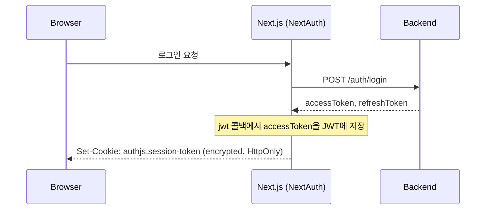

NextAuth JWT 전략의 동작은 다음과 같습니다.

1. `jwt` 콜백에서 백엔드가 준 `accessToken`을 NextAuth의 JWT 토큰에 추가합니다
2. 이 JWT 전체가 **암호화**되어 HTTP-Only 쿠키에 저장됩니다
3. 서버에서 `auth()` 함수를 호출하면 쿠키를 복호화하여 `accessToken`에 접근할 수 있습니다
4. 브라우저에서는 암호화된 쿠키이므로 **토큰에 직접 접근할 수 없습니다**

결과적으로 1부의 "서버 세션"과 같은 효과입니다. 별도 Redis나 DB 없이, **암호화된 쿠키 자체가 서버 세션** 역할을 합니다. 액세스 토큰은 서버 측에서만 접근 가능하고, 클라이언트는 암호화된 세션 쿠키만 가지고 있습니다.

### 문제: 모든 페이지가 CSR

액세스 토큰이 서버에만 있으므로, 이 프로젝트에서는 **모든 API 호출을 Server Action으로 처리**하고 있었습니다. 그리고 모든 `page.tsx`에 `"use client"`가 붙어 있어 전부 CSR(Client-Side Rendering)이었습니다.

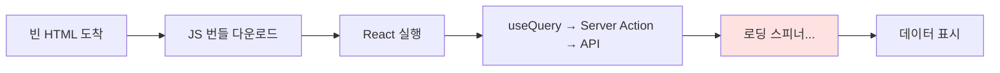

Next.js App Router를 쓰면서 SSR을 전혀 활용하지 않는 구조입니다. 1부에서 겪은 "브라우저 메모리" 문제는 해결되었지만, **SSR의 장점을 활용하지 못하는 문제**는 여전했습니다.

| 문제                             | 영향                   |
| -------------------------------- | ---------------------- |
| 매 페이지 로딩 스피너            | 체감 품질 저하         |
| 빈 HTML → JS 로드 후 렌더        | 레이아웃 깨짐          |
| 브라우저 → Next.js → API (2 hop) | 불필요한 네트워크 왕복 |
| 권한 체크가 클라이언트 전용      | JS 조작으로 우회 가능  |

Next.js를 쓰면서 모든 페이지를 `"use client"`로 만드는 것은 **Next.js의 가장 큰 장점(서버 렌더링)을 포기하는 것**입니다.

### 제안: 3가지 데이터 흐름 경로

이 문제를 해결하기 위해 **데이터 흐름을 용도별로 분리**하는 구조를 설계했습니다.

**1. 초기 로드 — SSR Prefetch**


페이지 초기 로드 시 서버에서 `auth()`로 토큰을 꺼내 API를 직접 호출합니다. 서버 → 서버 통신이라 내부망에서 수 ms면 됩니다.

**2. 리페치 — Route Handler Proxy**

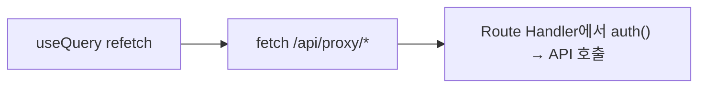

클라이언트에서 데이터를 다시 조회할 때 Route Handler를 경유합니다. 1부의 Proxy 패턴과 동일합니다.

**3. 뮤테이션 — Server Action**

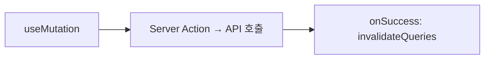

기존에 이미 Server Action으로 처리하고 있으므로 그대로 유지합니다.

### ProtectedPage 래퍼 패턴

이 구조를 모든 페이지에 일관되게 적용하기 위해 **`<ProtectedPage>` 래퍼 컴포넌트**를 설계했습니다.

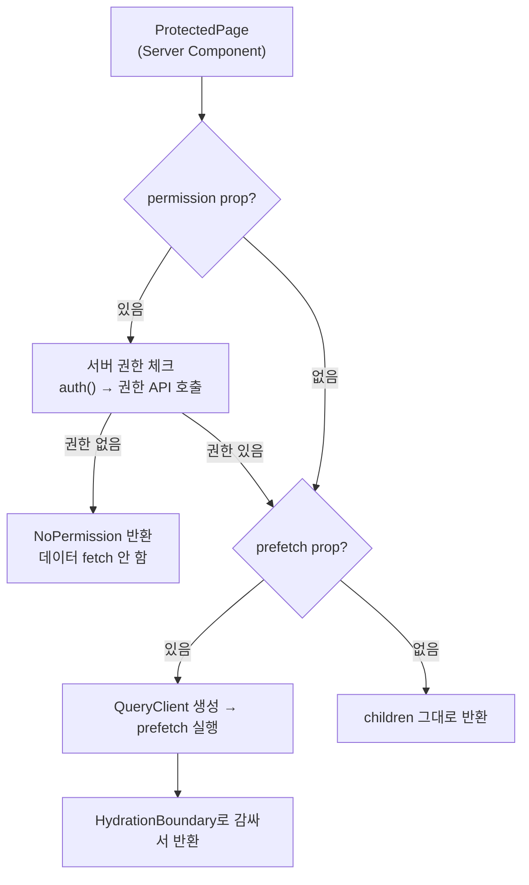

`<ProtectedPage>`는 Server Component로, 두 가지 역할을 선택적으로 수행합니다.

1. **서버 권한 체크**: 권한이 없으면 데이터를 아예 가져오지 않고 차단합니다. JS 조작으로 우회할 수 없습니다
2. **Prefetch + Hydration**: 서버에서 데이터를 미리 가져와 TanStack Query 캐시에 넣어둡니다

이렇게 하면 page.tsx가 극도로 단순해집니다.

```tsx
// app/dashboard/products/page.tsx (Server Component)
export default function ProductsPage() {
  return (
    <ProtectedPage permission="PRODUCT__R" prefetch={prefetchProductList}>
      <ProductList />
    </ProtectedPage>
  );
}
```

클라이언트의 `useQuery`는 기존 코드와 **완전히 동일**합니다. 다만 `HydrationBoundary`가 서버에서 가져온 데이터를 캐시에 넣어주므로, `useQuery`는 캐시 히트로 **로딩 스피너 없이 즉시 화면을 표시**합니다.

### SSR + Prefetch vs All CSR

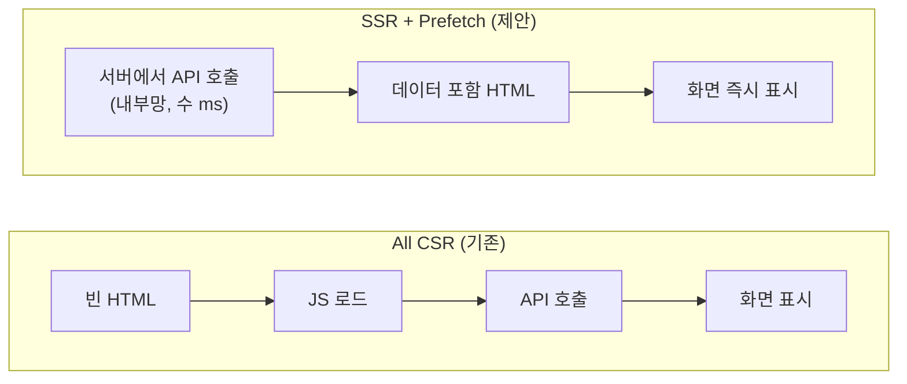

|                  | All CSR (기존)                   | SSR + Prefetch (제안)      |
| ---------------- | -------------------------------- | -------------------------- |
| 로딩 스피너      | 매 페이지                        | 없음                       |
| 레이아웃 깨짐    | HTML이 빈 껍데기                 | 데이터 포함 HTML           |
| 권한 체크        | 클라이언트 (우회 가능)           | 서버 (우회 불가)           |
| API 경로         | 브라우저 → Next.js → API (2 hop) | 서버 → API (1 hop, 내부망) |
| page.tsx 복잡도  | 200줄+ (UI + 로직 혼합)          | 5줄 (ProtectedPage 래핑)   |
| UI 컴포넌트 코드 | 동일                             | 동일                       |

핵심은 **UI 컴포넌트 코드를 전혀 바꾸지 않는다**는 점입니다. `useQuery`, `useMutation`, UI 라이브러리 모두 기존 그대로 사용합니다. 변경은 page.tsx의 래핑 방식뿐입니다.

---

## 마무리하며

두 프로젝트 경험에서 얻은 핵심 교훈은 세 가지입니다.

1. **JWT 액세스 토큰은 서버에서 관리**해야 SSR과 보안을 동시에 잡을 수 있습니다. 직접 서버 세션을 만들든 NextAuth JWT를 쓰든, 원칙은 같습니다
2. **클라이언트 요청은 Proxy 패턴**으로 서버의 토큰에 접근하게 합니다. Route Handler가 세션에서 토큰을 꺼내 백엔드에 전달하는 구조입니다
3. **SSR + Prefetch를 도입하면** 같은 인프라 비용으로 로딩 스피너 제거, 레이아웃 안정, 서버 권한 체크를 얻을 수 있습니다

"액세스 토큰을 어디에 저장하는가"에서 시작한 고민이 결국 **전체 애플리케이션 아키텍처**를 결정짓는 핵심 요소라는 것을 두 프로젝트를 거치며 확인했습니다.

### 참고 자료

- [Next.js App Router - Route Handlers](https://nextjs.org/docs/app/building-your-application/routing/route-handlers)
- [NextAuth.js - JWT Session Strategy](https://authjs.dev/getting-started/session-management/protecting)
- [TanStack Query - Server Rendering & Hydration](https://tanstack.com/query/latest/docs/framework/react/guides/advanced-ssr)
- [OWASP - JWT Security Cheat Sheet](https://cheatsheetseries.owasp.org/cheatsheets/JSON_Web_Token_for_Java_Cheat_Sheet.html)
