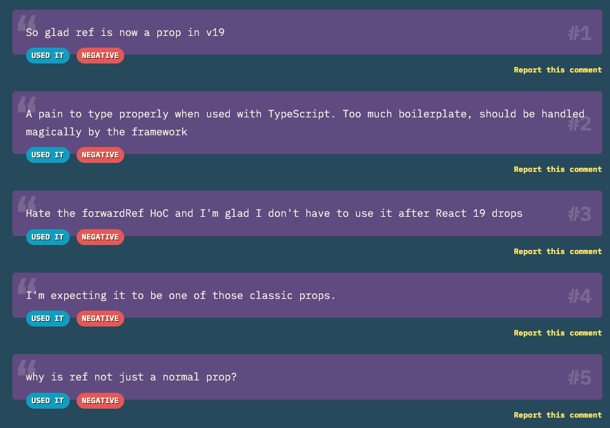

React v19 에서 **forwardRef** 더 이상 필요없어졌습니다. 향후 버전에서는 forwardRef를 제거한다고도 하는데요. 대신에 이제 **ref** 를 **prop** 에서 접근할 수 있도록 바뀌었습니다. 저는 이 결정에 너무나도 반가웠습니다. 이번 포스팅에서 왜 이러한 변경사항에 대해서 반가웠는지와 19버전 이전에 forwardRef를 쓰던 방식과 이후 forwardRef 대신 useRef를 어떻게 사용하면 되는지 알아보겠습니다.

## forwardRef란?

forwardRef는 부모 컴포넌트가 자식 컴포넌트의 DOM 요소나 인스턴스에 직접 접근할 수 있도록 해주는 React API입니다.

원래 React에서는 데이터가 부모에서 자식으로 한 방향으로만 흐르며, 함수형 컴포넌트는 기본적으로 **ref**를 직접 받을 수 없습니다. 이런 한계를 극복하기 위해 제공된 기능이 **forwardRef**입니다.

즉, **부모 컴포넌트에서 생성된 ref를 자식 컴포넌트 내부까지 전달**하여, 부모가 자식의 특정 DOM 요소를 직접 조작(예: 포커스 주기, 스크롤 이동 등)할 수 있게 해주는 기능입니다.

리액트는 컴포넌트 간의 참조 전달을 위해 **forwardRef**를 도입하여 함수형 컴포넌트에서도 **ref**를 전달할 수 있도록 했습니다. 그러나 forwardRef는 다음과 같은 문제점이 있었습니다.

- 가독성 저하: forwardRef를 사용하면 컴포넌트 정의가 복잡해져 코드의 가독성이 떨어집니다.

- 타입스크립트 문제: forwardRef를 사용할 때 타입 정의가 복잡해 집니다.

이러한 이유때문에 자식 컴포넌트의 DOM 요소를 조작할 때 불편함이 있었는데요.


2024년 한 리액트 설문조사에서는 forwardRef를 사용해본 사용자를 대상으로 부정평가가 23%나 나왔습니다. **useState**의 부정평가가 1%인 것을 대조했을 때 꽤나 큰 부정평가인데요.

한번 **forwardRef 사용법**에 대해서 간단하게 알아보겠습니다.

## forwardRef 사용법

간단하게 forwardRef를 이용하여 버튼을 누르면 맨 아래로 스크롤 해주는 기능을 보겠습니다.

```tsx
import { forwardRef, useRef } from "react";

const ChildComponent = forwardRef<
  HTMLTextAreaElement,
  React.TextareaHTMLAttributes<HTMLTextAreaElement>
>((props, ref) => {
  return <textarea ref={ref} placeholder="여기에 입력하세요." {...props} />;
});

function ParentComponent() {
  const textareaRef = useRef<HTMLTextAreaElement>(null);
  const handleChildComponentScrollToBottom = () => {
    if (textareaRef.current) {
      textareaRef.current.scrollTop = textareaRef.current.scrollHeight;
    }
  };
  return (
    <div>
      <ChildComponent
        ref={textareaRef}
        rows={10}
        value={new Array(100000).fill("a").join("")}
        style={{ height: "100px" }}
      />
      <button onClick={handleChildComponentScrollToBottom}>
        한번에 아래로 스크롤하기
      </button>
    </div>
  );
}
```

자식 컴포넌트(**ChildComponent**)의 DOM 요소를 조작하기 위해 자식 컴포넌트를 **forwardRef**로 선언하고 부모 컴포넌트에서 생성한 참조(ref)를 전달하여 자식 컴포넌트 내부의 DOM 요소에 직접 접근할 수 있게 합니다.

부모 컴포넌트인 **ParentComponent**에서는 **textareaRef**라는 참조를 생성하여 **ChildComponent**에 전달합니다. 이렇게 전달된 참조는 자식 컴포넌트 내부의 `<textarea>` 요소와 연결됩니다.

부모 컴포넌트에 있는 버튼을 클릭하면 **handleChildComponentScrollToBottom** 함수가 호출되면서, 자식 컴포넌트의 텍스트 영역을 가장 아래로 스크롤하도록 동작합니다. 즉, 부모 컴포넌트에서 자식 컴포넌트 내부의 DOM에 직접 접근하여 특정 동작(스크롤 등)을 수행할 수 있게 됩니다.

이러한 방식은 코드의 복잡성을 증가시키고 DOM에 직접 접근하기 때문에 **useImperativeHandle**같은 대체 방법을 사용하는 권장됩니다.

하지만 리액트 v19 부터 **forwardRef** 가 사용 중단됨으로써 부모 컴포넌트가 자식 컴포넌트를 참조하는 방식이 바뀌었습니다.

## React v19에서 ref를 prop으로 직접 전달하기

이제 React v19 부터 자식 컴포넌트의 DOM 요소를 조작하기 위해서 자식 컴포넌트에서 ref를 노출시키면 됩니다.

```tsx
import { useRef } from "react";

function ChildComponent({ ref, ...props }: React.ComponentProps<"textarea">) {
  return <textarea ref={ref} placeholder="여기에 입력하세요." {...props} />;
}

function ParentComponent() {
  const textareaRef = useRef<HTMLTextAreaElement>(null);
  const handleChildComponentScrollToBottom = () => {
    if (textareaRef.current) {
      textareaRef.current.scrollTop = textareaRef.current.scrollHeight;
    }
  };
  return (
    <div>
      <ChildComponent
        ref={textareaRef}
        rows={10}
        value={new Array(100000).fill("a").join("")}
        style={{ height: "100px" }}
      />
      <button onClick={handleChildComponentScrollToBottom}>
        한번에 아래로 스크롤하기
      </button>
    </div>
  );
}
```

이제 자식 컴포넌트가 **ref**를 일반 **prop**처럼 받아서 바로 사용할 수 있어, 코드가 훨씬 간결해졌습니다.

## 마무리하며



React v19부터 forwardRef 대신 ref를 prop으로 전달하는 방식을 알아보았습니다. 이를 통해 컴포넌트가 더 직관적이고 명확해졌으며, 코드의 가독성과 유지보수성 또한 향상되었다고 생각합니다. 마지막으로 forwardRef에 대한 설문조사 댓글을 보시며 마치겠습니다.
