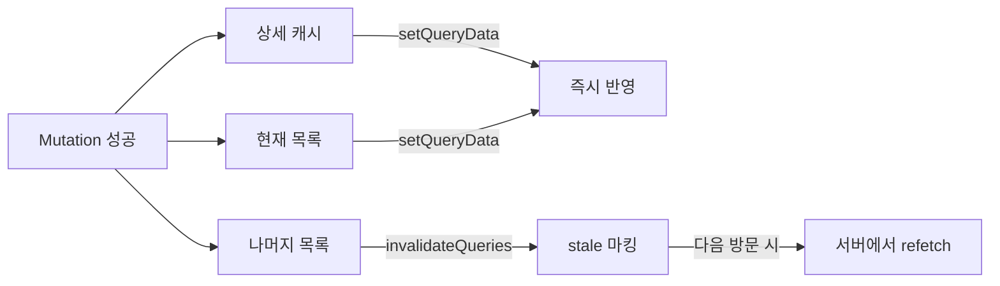

TanStack Query(구 React Query)를 사용하면서 처음에는 Query Key를 대충 `['todos']` 같이 쓰다가, 프로젝트가 커지면서 "이 키가 뭐였더라?" 하는 순간이 옵니다.

이 문제를 해결하는 **Query Key Factory 패턴**을 단계별로 알아보겠습니다. TanStack Query 메인테이너인 TkDodo(Dominik Dorfmeister)가 제안한 이 패턴은 커뮤니티에서 사실상 표준으로 자리잡았습니다.

## Query Key를 문자열로 직접 쓰면 생기는 문제

프로젝트가 커지면 같은 Query Key를 여러 파일에서 반복 사용하게 됩니다.

```typescript
// TodoList.tsx
useQuery({ queryKey: ["todos", "list", { filters }], queryFn: fetchTodos });

// TodoDetail.tsx
useQuery({ queryKey: ["todos", "detail", id], queryFn: () => fetchTodo(id) });

// useCreateTodo.ts - mutation 후 캐시 무효화
queryClient.invalidateQueries({ queryKey: ["todos", "list"] });

// useDeleteTodo.ts
queryClient.invalidateQueries({ queryKey: ["todos"] });

// prefetch.ts
queryClient.prefetchQuery({ queryKey: ["todos", "detail", id], queryFn: () => fetchTodo(id) });
```

이런 코드가 파일 10개, 20개로 퍼지면 세 가지 문제가 나타납니다.

1. **오타를 잡을 수 없습니다** - `'todos'`를 `'todo'`로 쓰면 캐시가 분리되는데, TypeScript는 둘 다 유효한 문자열이라 에러를 내지 않습니다
2. **구조 변경이 어렵습니다** - 키 구조를 바꾸고 싶으면 모든 파일을 찾아다니며 수정해야 합니다
3. **기억에 의존합니다** - "목록 키가 `['todos', 'list']`였나 `['todos', 'lists']`였나?" 점점 헷갈립니다

## 배경 지식: Query Key가 하는 일

Factory 패턴을 이해하려면 먼저 Query Key가 TanStack Query에서 어떤 역할을 하는지 알아야 합니다.

### Query Key의 세 가지 역할

1. **캐싱** - 내부적으로 Query Cache는 Query Key를 직렬화(serialize)한 문자열 키를 기반으로 데이터를 관리합니다
2. **자동 리페칭** - Query Key가 변경되면 자동으로 새 데이터를 가져옵니다
3. **수동 캐시 조작** - `invalidateQueries`, `setQueryData` 등으로 캐시를 직접 제어할 때 사용합니다

### "일반적 → 구체적" 구조

Query Key를 설계할 때 가장 중요한 원칙은 **넓은 범위에서 좁은 범위 순서로** 구성하는 것입니다.

```
['todos', 'list', { filters: 'all' }]   // 전체 목록
['todos', 'list', { filters: 'done' }]  // 완료된 목록
['todos', 'detail', 1]                   // 1번 할일 상세
['todos', 'detail', 2]                   // 2번 할일 상세
```

이렇게 하면 `invalidateQueries`의 **prefix 매칭**을 활용할 수 있습니다.

```typescript
// ['todos']로 시작하는 모든 쿼리 무효화
queryClient.invalidateQueries({ queryKey: ["todos"] });

// ['todos', 'list']로 시작하는 목록 쿼리만 무효화
queryClient.invalidateQueries({ queryKey: ["todos", "list"] });
```

`['todos']`를 전달하면 `['todos']`로 **시작하는** 모든 쿼리가 매칭되는 겁니다. 이 원칙을 이해해야 Factory 패턴이 왜 저런 구조인지 납득이 됩니다.

## Query Key Factory 패턴

핵심 아이디어는 단순합니다. **Query Key를 직접 문자열로 쓰지 말고, 키를 생성해주는 함수들의 모음 객체를 만들자.**

```typescript
const todoKeys = {
  all: ["todos"] as const,
  lists: () => [...todoKeys.all, "list"] as const,
  list: (filters: string) => [...todoKeys.lists(), { filters }] as const,
  details: () => [...todoKeys.all, "detail"] as const,
  detail: (id: number) => [...todoKeys.details(), id] as const,
};
```

이게 전부입니다. 객체 하나에 키 생성 함수들을 모아놓은 것입니다.

### 각 항목이 만들어내는 키

```typescript
todoKeys.all; // ['todos']
todoKeys.lists(); // ['todos', 'list']
todoKeys.list("done"); // ['todos', 'list', { filters: 'done' }]
todoKeys.details(); // ['todos', 'detail']
todoKeys.detail(1); // ['todos', 'detail', 1]
```

계층 구조로 보면 이렇습니다.

```
todoKeys.all  →  ['todos']
├── todoKeys.lists()  →  ['todos', 'list']
│   ├── todoKeys.list('all')   →  ['todos', 'list', { filters: 'all' }]
│   └── todoKeys.list('done')  →  ['todos', 'list', { filters: 'done' }]
└── todoKeys.details()  →  ['todos', 'detail']
    ├── todoKeys.detail(1)  →  ['todos', 'detail', 1]
    └── todoKeys.detail(2)  →  ['todos', 'detail', 2]
```

각 함수가 **상위 키를 spread**하면서 만들어지기 때문에, "일반적 → 구체적" 구조가 자동으로 보장됩니다.

### 적용하면 어떻게 바뀌는지

아까 문자열로 흩어져 있던 코드가 이렇게 바뀝니다.

```typescript
// TodoList.tsx
useQuery({
  queryKey: todoKeys.list(filters),
  queryFn: () => fetchTodos(filters),
});

// TodoDetail.tsx
useQuery({
  queryKey: todoKeys.detail(id),
  queryFn: () => fetchTodo(id),
});

// useCreateTodo.ts
queryClient.invalidateQueries({ queryKey: todoKeys.lists() });

// useDeleteTodo.ts
queryClient.invalidateQueries({ queryKey: todoKeys.all });

// prefetch.ts
queryClient.prefetchQuery({
  queryKey: todoKeys.detail(id),
  queryFn: () => fetchTodo(id),
});
```

- **오타?** `todoKeys.detial`이면 TypeScript가 바로 에러를 냅니다.
- **구조 변경?** `todoKeys` 객체 하나만 수정하면 끝입니다.
- **기억 의존?** IDE 자동완성이 모든 옵션을 보여줍니다.

### as const가 필요한 이유

Factory 코드에서 `as const`가 빠지면 어떻게 되는지 살펴보겠습니다.

```typescript
// as const 없이
const keys = {
  all: ["todos"], // 타입: string[]
  detail: (id: number) => ["todos", "detail", id], // 타입: (string | number)[]
};

// as const 사용
const keys = {
  all: ["todos"] as const, // 타입: readonly ['todos']
  detail: (id: number) => ["todos", "detail", id] as const, // 타입: readonly ['todos', 'detail', number]
};
```

`as const` 없이는 TypeScript가 `string[]`으로 넓게 추론합니다. 그러면 `['todos']`와 `['users']`가 같은 타입이 되어버려서, 잘못된 키를 전달해도 에러가 나지 않습니다. `as const`를 사용하면 **정확한 튜플 타입**이 되어 키 간의 구분이 타입 레벨에서 보장됩니다.

## queryOptions()와 결합하기

여기까지만 해도 충분히 유용하지만, 한 가지 아쉬운 점이 있습니다. **Query Key와 Query Function이 여전히 따로 놀고 있다는 것**입니다.

```typescript
// 키는 todoKeys에 있고
queryKey: todoKeys.list(filters),
// 함수는 사용하는 곳에서 직접 정의
queryFn: () => fetchTodos(filters),
```

`filters`가 키에도, 함수에도 쓰이는데 둘이 따로 관리되면 실수할 여지가 있습니다. TanStack Query v5에서 도입된 `queryOptions()`를 사용하면 이 문제를 해결할 수 있습니다.

### queryOptions()가 하는 일

런타임에서 `queryOptions()`는 놀랍게도 **아무것도 하지 않습니다**.

```typescript
// 실제 소스 코드 (진짜 이게 끝입니다)
export function queryOptions(options) {
  return options; // 받은 거 그대로 돌려줌
}
```

`queryOptions()`가 필요한 이유는 **TypeScript 타입 안전성** 때문입니다.

### 문제: 객체를 변수로 빼면 오타를 못 잡는다

```typescript
// 인라인으로 쓰면 → 오타를 TypeScript가 잡아줌
useQuery({
  queryKey: ["todos"],
  queryFn: fetchTodos,
  stallTime: 5000, // ❌ Error: 'stallTime' 속성이 존재하지 않습니다 (staleTime 오타)
});
```

```typescript
// 변수로 빼면 → 오타를 못 잡음
const todosConfig = {
  queryKey: ["todos"],
  queryFn: fetchTodos,
  stallTime: 5000, // ⚠️ 에러가 안 납니다!
};
useQuery(todosConfig); // stallTime은 무시되고 기본값이 적용됨
```

이것은 TypeScript의 **초과 속성 검사(Excess Property Checking)** 가 object literal에만 적용되기 때문입니다. `useQuery({ ... })`처럼 직접 넘기면 "이 객체는 여기서만 쓰인다"고 판단해 불필요한 속성을 잡아주지만, 변수에 담으면 "다른 곳에서도 쓸 수 있는 객체"로 보고 필요한 속성만 확인합니다.

`queryOptions()`로 감싸면 해결됩니다.

```typescript
import { queryOptions } from "@tanstack/react-query";

const todosConfig = queryOptions({
  queryKey: ["todos"],
  queryFn: fetchTodos,
  stallTime: 5000, // ❌ Error: 'stallTime' 속성이 존재하지 않습니다
});
```

`queryOptions()`의 타입 시그니처가 "이 객체는 Query 설정이다"라고 TypeScript에게 알려주기 때문에, 잘못된 속성을 넣으면 바로 에러가 발생합니다.

### DataTag: 자동 타입 추론

`queryOptions()`의 가장 강력한 기능은 **DataTag**입니다. Query Key에 Query Function의 반환 타입 정보를 자동으로 연결해줍니다.

```typescript
// queryOptions 없이 → 타입을 수동으로 지정해야 함
const todos = queryClient.getQueryData<Todo[]>(["todos"]);
//                                     ^^^^^^ 매번 수동으로 작성
```

```typescript
// queryOptions 사용 → 자동 추론
const todosQuery = queryOptions({
  queryKey: ["todos"],
  queryFn: fetchTodos, // Returns Promise<Todo[]>
});

const todos = queryClient.getQueryData(todosQuery.queryKey);
//    ^? Todo[] | undefined  ← 제네릭 없이 자동 추론!

queryClient.setQueryData(todosQuery.queryKey, (old) => {
  //                                             ^? Todo[] | undefined
  return old?.filter((todo) => !todo.done); // 타입 안전하게 조작
});
```

`queryOptions()`가 내부적으로 `queryKey`에 DataTag라는 타입 메타데이터를 심어놓기 때문에, 그 키를 `getQueryData`나 `setQueryData`에 넘기면 **queryFn의 반환 타입이 자동으로 연결**됩니다.

### 최종 진화형: Key Factory + queryOptions()

이제 두 패턴을 결합하면 최종형이 완성됩니다. 앞서 `all`은 값이었지만, queryOptions와 결합할 때는 **모든 항목을 함수로 통일**하면 API가 일관됩니다.

```typescript
import { queryOptions } from "@tanstack/react-query";

const todoQueries = {
  // 키만 반환하는 항목 → invalidation용
  all: () => ["todos"] as const,
  lists: () => [...todoQueries.all(), "list"] as const,
  details: () => [...todoQueries.all(), "detail"] as const,

  // queryOptions를 반환하는 항목 → 실제 쿼리 실행용
  list: (filters: string) =>
    queryOptions({
      queryKey: [...todoQueries.lists(), { filters }] as const,
      queryFn: () => fetchTodos(filters),
      staleTime: 1000 * 60,
    }),

  detail: (id: number) =>
    queryOptions({
      queryKey: [...todoQueries.details(), id] as const,
      queryFn: () => fetchTodo(id),
      staleTime: 1000 * 60 * 5,
    }),
};
```

핵심은 **두 가지 레벨을 혼합**한다는 점입니다.

- `all()`, `lists()`, `details()` → **키 배열만 반환** (invalidation, removeQueries에 사용)
- `list()`, `detail()` → **queryOptions 객체 반환** (useQuery, prefetchQuery에 사용)

## 실전 적용

### 컴포넌트에서 사용

```typescript
function TodoList({ filters }: { filters: string }) {
  // todoQueries.list()가 queryOptions를 반환하므로 그대로 전달
  const { data: todos } = useQuery(todoQueries.list(filters))

  return (
    <ul>
      {todos?.map(todo => (
        <li key={todo.id}>{todo.title}</li>
      ))}
    </ul>
  )
}

function TodoDetail({ id }: { id: number }) {
  // Suspense와도 동일하게 사용
  const { data: todo } = useSuspenseQuery(todoQueries.detail(id))

  return <h1>{todo.title}</h1>
}
```

### Mutation 후 캐시 업데이트

Mutation이 성공하면 관련 캐시를 업데이트해야 합니다. 모든 걸 invalidation으로 처리할 수도 있지만, 직접 업데이트와 invalidation을 혼합하면 더 효율적입니다.



```typescript
function useUpdateTodo() {
  const queryClient = useQueryClient();
  const { filters } = useFilterParams();

  return useMutation({
    mutationFn: updateTodo,
    onSuccess: (newTodo) => {
      // 상세 캐시는 직접 업데이트 (네트워크 요청 없이 즉시 반영)
      queryClient.setQueryData(todoQueries.detail(newTodo.id).queryKey, newTodo);

      // 현재 보고 있는 목록은 직접 업데이트
      queryClient.setQueryData(todoQueries.list(filters).queryKey, (previous) =>
        previous?.map((todo) => (todo.id === newTodo.id ? newTodo : todo))
      );

      // 나머지 목록들은 stale로 마킹만 해둠
      queryClient.invalidateQueries({
        queryKey: todoQueries.lists(),
        refetchType: "none",
      });
    },
  });
}
```

현재 보고 있는 상세와 목록은 **직접 업데이트**로 즉시 반영하고, 보고 있지 않은 다른 목록들은 `refetchType: 'none'`으로 **stale 마킹만** 해둡니다. 나중에 해당 목록을 열면 그때 새로 가져옵니다. 불필요한 네트워크 요청을 줄이는 스마트한 패턴입니다.

### 페이지 프리페칭

```typescript
// React Router loader에서 사용
async function todoDetailLoader({ params }) {
  // ensureQueryData: 캐시에 있으면 재사용, 없으면 fetch
  await queryClient.ensureQueryData(todoQueries.detail(Number(params.id)));
}
```

`todoQueries.detail(id)`가 `queryKey`와 `queryFn`을 모두 포함하고 있기 때문에, `ensureQueryData`에 그대로 전달하면 됩니다. 키와 함수를 따로 전달할 필요가 없습니다.

### 프로젝트 디렉토리 구조

```
src/
├── features/
│   ├── todos/
│   │   ├── queries.ts       ← todoQueries 팩토리 + API 함수
│   │   ├── TodoList.tsx
│   │   ├── TodoDetail.tsx
│   │   └── useUpdateTodo.ts
│   └── users/
│       ├── queries.ts       ← userQueries 팩토리 + API 함수
│       ├── UserProfile.tsx
│       └── useUpdateUser.ts
```

각 기능(feature) 디렉토리에 `queries.ts`를 두고, 해당 기능의 **팩토리 객체와 API 함수를 함께 관리**합니다. 컴포넌트에서는 이 파일만 import하면 됩니다.

## 대안: @lukemorales/query-key-factory

직접 팩토리 객체를 만드는 것이 번거롭다면, [@lukemorales/query-key-factory](https://github.com/lukemorales/query-key-factory) 라이브러리를 사용할 수도 있습니다.

```bash
pnpm add @lukemorales/query-key-factory
```

```typescript
import { createQueryKeys, mergeQueryKeys } from "@lukemorales/query-key-factory";

const todoKeys = createQueryKeys("todos", {
  list: (filters: string) => ({
    queryKey: [filters],
    queryFn: () => fetchTodos(filters),
  }),
  detail: (id: number) => ({
    queryKey: [id],
    queryFn: () => fetchTodo(id),
  }),
});

const userKeys = createQueryKeys("users", {
  profile: (userId: string) => ({
    queryKey: [userId],
    queryFn: () => fetchUser(userId),
  }),
});

// 여러 도메인의 키를 하나로 합침
const queryKeys = mergeQueryKeys(todoKeys, userKeys);
```

`createQueryKeys`가 자동으로 prefix를 추가하고, TypeScript 자동완성을 제공합니다. 다만 TanStack Query v5의 `queryOptions()`가 이미 충분히 강력하기 때문에, 라이브러리 없이 직접 만드는 것도 좋은 선택입니다.

## 단계별 정리

| 단계      | 패턴                                         | 해결하는 문제                                  |
| --------- | -------------------------------------------- | ---------------------------------------------- |
| **1단계** | `['todos', 'list']` 문자열 직접 사용         | 없음 (문제의 시작)                             |
| **2단계** | `todoKeys.lists()` Key Factory               | 오타 방지, 중앙 관리, 자동완성                 |
| **3단계** | `todoQueries.list(filters)` + queryOptions() | 키-함수 동기화, 타입 자동 추론, 설정 오타 검출 |

## 마무리하며

Query Key Factory 패턴은 TanStack Query 메인테이너인 [TkDodo의 블로그](https://tkdodo.eu/blog/effective-react-query-keys)에서 시작된 커뮤니티 컨벤션이지만, v5에서 `queryOptions()`라는 공식 API와 결합하면서 사실상 표준 패턴이 되었습니다.

핵심은 두 가지입니다.

1. **Query Key를 "일반적 → 구체적" 계층 구조로 설계**하면 invalidation이 유연해집니다
2. **queryOptions()로 Key와 Function을 함께 묶으면** 타입 안전성과 유지보수성을 모두 잡을 수 있습니다

### 참고 자료

- [Effective React Query Keys - TkDodo](https://tkdodo.eu/blog/effective-react-query-keys)
- [The Query Options API - TkDodo](https://tkdodo.eu/blog/the-query-options-api)
- [Practical React Query - TkDodo](https://tkdodo.eu/blog/practical-react-query)
- [TanStack Query v5 공식 문서 - Query Keys](https://tanstack.com/query/v5/docs/react/guides/query-keys)
- [@lukemorales/query-key-factory](https://github.com/lukemorales/query-key-factory)
